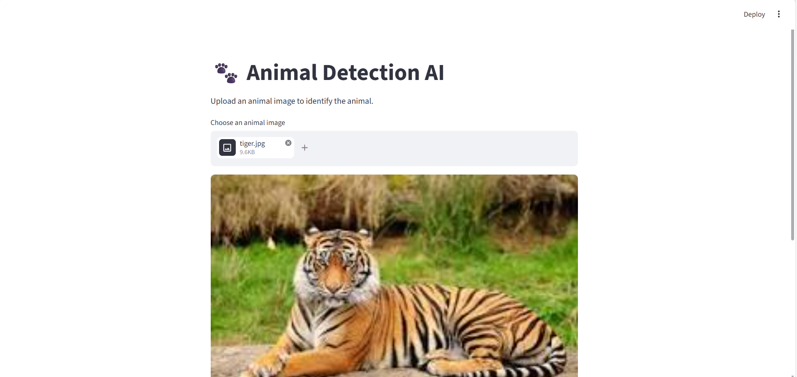
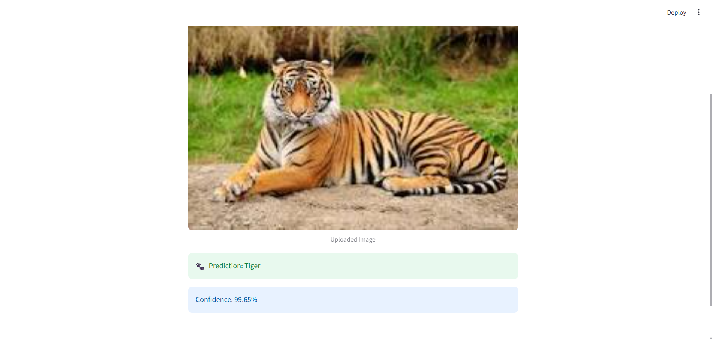

#  Animal Detection AI

An AI-powered Animal Detection and Classification System built using **TensorFlow, MobileNetV2, and Streamlit**.

This project allows users to upload an animal image and predicts the animal species using a deep learning model trained on multiple animal classes.

The application uses **Transfer Learning** with MobileNetV2 for accurate and efficient image classification.

---

#  Features

 AI-Based Animal Classification  
 90 Animal Categories Supported  
 Deep Learning Model using MobileNetV2  
 Streamlit Web Application  
 Image Upload Support  
 Confidence Score Display  
 Low Confidence Warning System  
 Real-Time Predictions  
 Data Augmentation for Better Accuracy  
 Responsive User Interface  

---

##  Screenshots

##  Home Page



---

##  Prediction Example

s
#  Tech Stack

| Technology | Usage |
|---|---|
| Python | Core Programming |
| TensorFlow / Keras | Deep Learning |
| MobileNetV2 | Transfer Learning Model |
| Streamlit | Web Interface |
| NumPy | Numerical Operations |
| ImageDataGenerator | Data Augmentation |

---

#  Model Architecture

The project uses:

- **MobileNetV2** pretrained on ImageNet
- Transfer Learning approach
- Frozen base layers
- Custom Dense layers
- Dropout regularization

---

#  Project Structure

```bash
Animal-Detection-AI/
│
├── dataset/
│
├── screenshots/
│   ├── home.png
│   └── prediction.png
│
├── animal_model.keras
├── train.py
├── app.py
├── requirements.txt
└── README.md
```

---

# ️ Installation & Setup

## Step 1 — Clone Repository

```bash
git clone https://github.com/YOUR_USERNAME/Animal-Detection-AI.git
```

---

## Step 2 — Open Project Folder

```bash
cd Animal-Detection-AI
```

---

## Step 3 — Install Dependencies

```bash
pip install -r requirements.txt
```

---

## Step 4 — Run Streamlit App

```bash
streamlit run app.py
```

---

# requirements.txt

```txt
tensorflow
streamlit
numpy
pillow
```

---

#  Model Training

Run:

```bash
python train.py
```

The model will:
- Load dataset
- Preprocess images
- Train using MobileNetV2
- Save trained model as:

```bash
animal_model.keras
```

---

#  Supported Animal Classes

The model supports 90 animal categories including:

- Tiger
- Lion
- Elephant
- Dog
- Cat
- Zebra
- Bear
- Panda
- Wolf
- Deer
- Fox
- Horse
- Cow
- Dolphin
- Eagle
- Penguin
and many more.

---

#  Prediction Workflow

1. Upload animal image  
2. Image preprocessing  
3. Feature extraction using MobileNetV2  
4. Model prediction  
5. Display animal name and confidence score  

---

# ⚠ Low Confidence Detection

If prediction confidence is below 60%:

- Warning message is displayed
- User is informed that prediction may be inaccurate

This improves reliability and user experience.

---

#  Data Augmentation Used

To improve model performance:
- Rotation
- Zoom
- Horizontal Flip
- Validation Split

This helps reduce overfitting.

---

#  Learning Outcomes

This project demonstrates:

- Deep Learning
- Transfer Learning
- Image Classification
- TensorFlow/Keras
- Streamlit Deployment
- Data Augmentation
- Model Training
- AI Application Development

---

#  Future Improvements

 Real-Time Webcam Detection  
 Object Detection with YOLO  
 Higher Accuracy Training  
 Animal Information System  
 Voice Output  
 Deployment on Hugging Face / Render  
 Multiple Animal Detection  

---

#  Use Cases

- Wildlife Monitoring
- Educational AI Projects
- Animal Recognition Systems
- Computer Vision Practice
- Internship Portfolio Projects
- AI-Based Classification Systems

---

#  Key Highlights

✔ Deep Learning Based Project  
✔ Real-world AI Application  
✔ Transfer Learning Implementation  
✔ Streamlit Interactive UI  
✔ Multiple Animal Categories  
✔ Confidence-Based Prediction System  
✔ Beginner-Friendly AI Project  

---

#  Contributing

Contributions are welcome.

To contribute:
1. Fork the repository
2. Create a new branch
3. Make changes
4. Submit a pull request

---


---


## Sonu Thakur

Engineering Student  
Python & Machine Learning Enthusiast 

GitHub:
```md
https://github.com/5onu-hub
```

---

